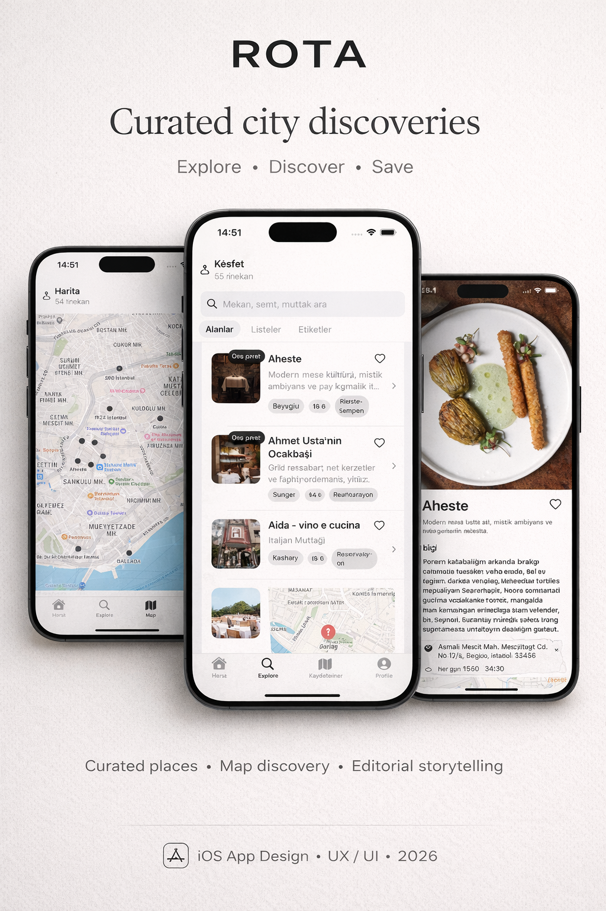

## Rota İstanbul (SwiftUI, static data)

- SwiftUI iOS app with map, filters (kategori, fiyat, semt), favoriler, öne çıkanlar ve detay ekranı. Veriler statik olarak `MockData` içinde saklanıyor.

### Çalıştırma
- Xcode'da yeni bir **App** projesi (SwiftUI, Swift) açın, hedefi iOS 17+ seçin.
- Bu repo'daki Swift dosyalarını `IstanbulRotaApp.swift`, `ContentView.swift`, `Models/`, `Data/`, `Views/`, `ViewModels/` klasörleriyle projenize ekleyin.
- `IstanbulRotaApp` giriş noktasıdır; `@main` ile geliyor. Derleyip iPhone simülatöründe veya gerçek cihazda çalıştırın.

### Veriyi ekleme/güncelleme
- Tüm restoranlar `Data/MockData.swift` içindeki `MockData.places` dizisinde tutuluyor.
- Yeni mekan eklemek için dizinin sonuna yeni bir `Place` örneği ekleyin:
  - `name`, `headline`, `description`, `address`, `phone`, `hours`
  - `categories: [.restaurant, .bar, ...]` (`Models/PlaceCategory.swift` içinde enum'lar)
  - `price: .affordable | .mid | .premium | .luxury`
  - `area: .besiktas | .beyoglu | ...` (`Area` enum'unda olmayan semtleri eklemek için enum'a yeni case ekleyin)
  - `tags: ["Kokteyl", "Brunch"]` gibi serbest etiketler
  - `coordinate: CLLocationCoordinate2D(latitude: , longitude: )` ile haritada pin
  - `isFeatured: true` öne çıkan listesinde görünür; `isBookable: true` rozeti açar.
- Mevcut bir mekanı güncellemek için ilgili `Place` nesnesindeki alanı düzenleyin.
- Favoriler `PlaceStore` içinde `Set<UUID>` olarak tutulur; statik veriyi değiştirirken `id` alanını koruyun ki favoriler bozulmasın. Yeni eklerken `id`'yi boş bırakın, otomatik üretilecek.

### Sistem/özellik notları
- Filtreler: kategori, fiyat, semt, favoriler ve arama (`ContentView` içinde `filteredPlaces` fonksiyonu).
- Harita: `Map` bileşeni, seçilen pin için vurgu; başlangıç görüşü Taksim merkezli (`Views/IstanbulMapView.swift`).
- Detay: adres, telefon, web linki, tag'ler, çalışma saatleri ve küçük harita önizlemesi (`Views/PlaceDetailView.swift`).
- Görseller: şu an placeholder; Xcode'da `Assets.xcassets` altına görsel ekleyip `imageName` ile eşleyebilirsiniz.

### Sonraki adımlar (isteğe bağlı)
- Rezervasyon/booking entegrasyonu için bir deeplink veya webview açan buton ekleyin.
- Gerçek veri kaynağına geçiş için JSON dosyası veya bir hafif API katmanı ekleyin; `PlaceStore`'u `async` yükleme yapacak şekilde genişletin.
